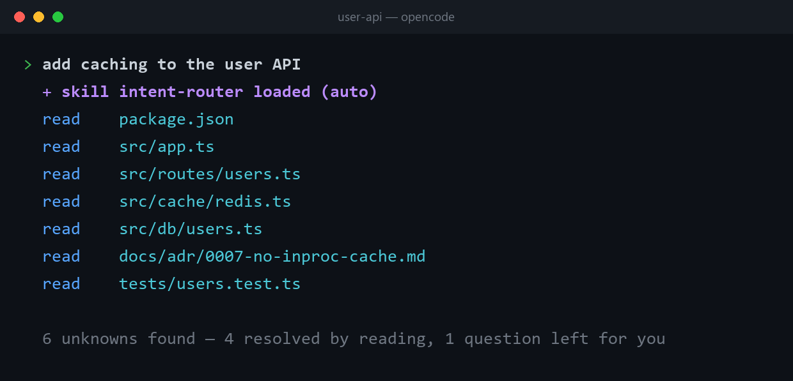
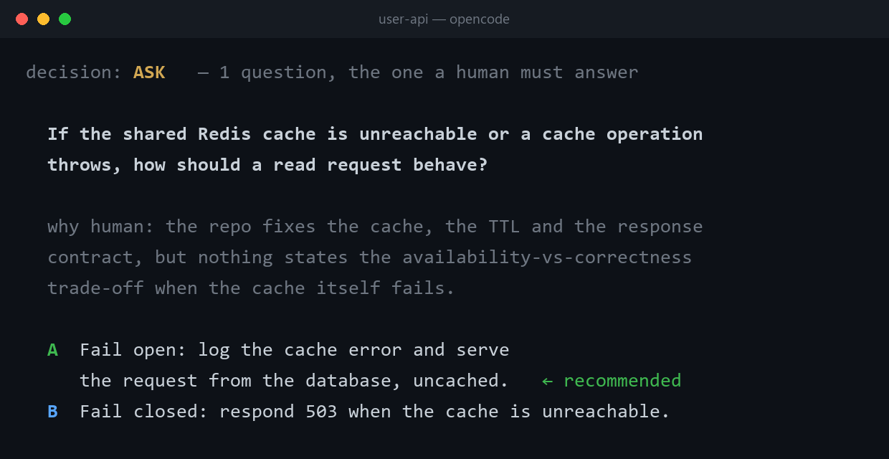
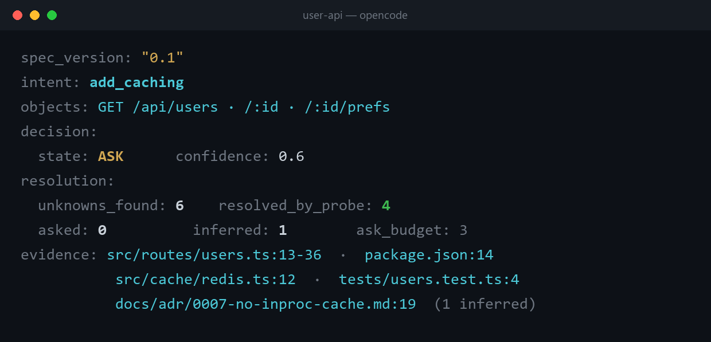

# Intent-Router

English | [简体中文](README.zh-CN.md)

**An intent compiler for AI agents.**

Turns a vague request into a typed `IntentSpec`: it looks up what it can, asks only what it
can't, calls out a request that contradicts itself, admits two readings, or rests on a premise
your own repo already disproves, and refuses to emit while the intent is still underspecified.
When the work gets handed off and carried out, it checks the result against the spec it wrote —
one constraint at a time, not a vibe check.

What that buys you:

- **Prompt equity.** You get the interaction of a senior engineer without having to learn prompt
  engineering — the gap between the top 1% of prompt writers and everyone else stops deciding what
  you get back. Say it the way you'd say it to a capable teammate, *"add caching to the user API"*,
  and the skill writes the briefing a senior engineer would have written first. You stop coaxing
  the model and start putting it to work.
- It asks one question, and the answer lands in the delivered code. Before anything reaches you it
  reads what your repo, ticket system or docs already answer, so the forty-six-question interview
  becomes the one question that genuinely needs your judgment — and in the delivery comparison,
  every run with the skill asks exactly that one question and 3 of 3 delivered caches state their
  failure policy, while none of the 5 bare deliveries do
  ([report](evals/reports/2026-09-24-delivery-opencode.md)).
- The work carries further. Every run ends in a machine-readable `IntentSpec`, saved to
  `.intent/<intent>.intent.yaml` before the reply that carries it, whose probed fields carry
  evidence pointers — so the output rests on what your project actually says rather than on an
  unstated guess, and the next agent, session or teammate starts from that contract file instead
  of zero.

[](LICENSE)
[](https://github.com/angel291592/Intent-Router/releases)
[](https://github.com/angel291592/Intent-Router/actions/workflows/ci.yml)
[](https://github.com/angel291592/Intent-Router/stargazers)
[](#backends)

### What "installed" changes, in the diff itself

Same weak request, same fixture, same permissions, one line apart —
[bare vs. with the skill](evals/reports/2026-09-24-delivery-opencode.md) (N=5 bare, N=3 skill).
Excerpted verbatim from each run's own `diff.patch`, the part that decides what happens when the
cache itself fails:

**Bare** — no failure path exists to read. A downed Redis takes the request down with it:

```ts
const hit = await getCache<T>(key);
if (hit !== null) {
  return hit;
}
const value = await load();
if (value !== null) {
  await setCache(key, value);
}
return value;
```

**With the skill** — asked the one question no file could answer, then wrote the answer into the
code:

```ts
async function readCache<T>(key: string): Promise<{ hit: boolean; value: T | null }> {
  try {
    return { hit: true, value: await getCache<T>(key) };
  } catch {
    return { hit: false, value: null };
  }
}
```

Every one of the 5 bare runs shipped the first shape; every one of the 3 skill runs shipped the
second. Neither line was written by hand for this README — both come straight out of the runs
that produced the numbers in [Evals](#evals).

```
          "add caching to the user API"       "this customer is furious — sort it out"
                        │                                         │
                        ▼                                         ▼
 ┌────────────────────────────────────────────────────────────────────────────────────┐
 │  parse  →  resolve  →  typecheck  →  emit                    one engine, one spec  │
 ├────────────────────────────────────────────────────────────────────────────────────┤
 │  PROBE   deps, routes, git history, ADRs   │  order + ticket log, entitlements,    │
 │          — you are not interrupted         │  the policy in force                  │
 │                                            │                                       │
 │  ASK     serve stale, or serve uncached?   │  refund, or replace?                  │
 │          the one answer no file holds      │  the one that can't be undone         │
 └────────────────────────────────────────────────────────────────────────────────────┘
                        │                                         │
                        ▼                                         ▼
              IntentSpec  ──────►  your planner / agent / workflow / human
```

Same three passes. Same stopping predicate. Only the places it looks change.

<!-- demo:begin -->
What a real run looks like — one sentence in, it reads the repo itself and asks only what no
file can answer. From the measured run of 2026-09-23 behind the numbers below: 8 of the 10 cases
the suite held that day, 0 hallucinated evidence.

<p align="center">
  <br><br>
  <br><br>
  
</p>
<!-- demo:end -->

No install, no API key, no dependencies — it's a skill:

```bash
npx skills add angel291592/Intent-Router
```

Manual install, or an agent the installer doesn't know: [Quick start](#quick-start).

---

## Contents

- [How it compares](#how-it-compares)
- [The problem](#the-problem) · [How it works](#how-it-works) · [The four decision states](#the-four-decision-states)
- [Two walkthroughs](#two-walkthroughs) — one in a codebase, one in a support queue
- [The artifact](#the-artifact) · [Where it works](#where-it-works) · [Quick start](#quick-start) · [Evals](#evals)
- [Design principles](#design-principles) · [Limitations](#limitations)
- [Backends](#backends) · [Prior art](#prior-art) · [Contributing](#contributing)

---

## How it compares

**Intent-Router is the layer five good tools leave empty: deciding whether to look, ask, or act —
before acting.** Your harness's own plan mode already prefers looking things up over asking, and
grill-me converges beautifully and states the right principle — but neither one checks a stated
premise against the evidence, and neither one checks the finished work against what was decided.
spec-kit keeps everything and makes you buy its whole workflow to get it. Kiro's specs come
closest on paper — requirement-level conflict analysis, a correctness check after delivery — at
the cost of a full three-file spec workflow and an IDE. Jev and Laya sit one layer downstream of
all of this: both turn an *already-clear* input into a typed, calibrated decision in a single
pass — Jev as a closed API, Laya as the open-weights, locally-runnable alternative — but neither
one converges a vague request into that clear input to begin with, which is exactly the layer
Intent-Router occupies. Intent-Router is the one-skill version of that upstream layer: no
workflow to adopt, no files to keep in sync by hand, no IDE, no separate decision service to run.

Read the row gaps, not the checkmarks. Every cell below is sourced to the tool's own docs or repo —
quoted cells are verbatim, and an unquoted ✅/⚠️/❌ still traces to a specific page.

| | Converges vague input | Doesn't ask what it can look up | Uses evidence against contradictions & bad premises | Never guesses past irreversible | Cross-session artifact | Checks delivery against intent | Fires automatically |
|---|---|---|---|---|---|---|---|
| **Intent-Router** | ✅ | ✅ `PROBE` | ✅ `ambiguous` / `conflict` / `premise` | ✅ `HALT` | ✅ `.intent/*.yaml` | ✅ `Intent check` | ✅ |
| Your harness's native plan mode + question tool | ✅ asks | ⚠️ varies — Codex's plan template states the rule outright; Claude Code and Cursor explore but document none | ❌ not documented on any of the three | ⚠️ an approval gate, not a risk-based one | ✅ Claude Code, Cursor save a plan file; Codex's plan lives in the reply | ❌ not documented | ⚠️ Claude Code's tool is model-invoked; Cursor only suggests; Codex needs an explicit switch |
| [grill-me](https://github.com/mattpocock/skills) | ✅ rounds/frontier | ✅ *"don't ask the user for anything you could look up yourself"* | ❌ not documented | ✅ *"the decisions are the user's"* | ❌ stateless by design | ❌ not documented | ❌ manual (`/grill-me`) |
| [spec-kit `/clarify`](https://github.com/github/spec-kit) | ✅ category scan, ≤5 questions | ⚠️ excludes questions *"already answered"*, not questions the repo could answer | ⚠️ a separate command, `/analyze`, flags conflicting requirements | ⚠️ flags unresolved items as "Deferred", no reversibility test | ✅ writes into `spec.md` | ✅ a separate command, `/converge` | ❌ manual, one `/speckit-*` command at a time |
| [Kiro specs](https://kiro.dev/docs/specs) | ✅ *"asks clarifying questions if needed"* | ⚠️ *"codebase exploration"*, no stated rule | ⚠️ `analyze-requirements` finds inconsistencies across the requirement set (IDE/CLI only) | not documented | ✅ three files per spec | ✅ property-based "Correctness" checks (IDE only) | ❌ manual (`Shift+Tab` / `/plan`) |
| [Jev](https://www.jevai.org/) (typed decisions) | ❌ needs clear input already | — | — | — | — | — | ✅ |
| [Laya](https://github.com/NandhaKishorM/laya) (open-source System 1) | ❌ needs a formed state to classify | — | — | — | — | — | ✅ |

Jev and Laya's row is mostly `—`, not `❌`: they are the System 1 **decision** layer, called once
a request is already well-formed, which is a different job from converging one, so most of these
columns simply do not apply to them. Jev is a closed API; Laya is the open-weights,
Jev-wire-compatible alternative you can run locally. The `IntentSpec` this skill emits is the
shape of input both of them assume already exists.

### What your harness already does — and what this adds

To be fair: a good harness natively prefers looking things up over asking, and offers a
recommended default when it does ask. In the delivery comparison, all 5 bare runs read
`docs/adr/0007-no-inproc-cache.md` on their own and avoided the trap it warns about — that habit
is real, and it is not this skill's contribution. Nothing else on this page should be read as
claiming it is.

What it adds is the part a conversation cannot hold:

- **The contract outlives the session.** Native answers live in the conversation — compress the
  context, open a new session, switch models, and they are gone. An `IntentSpec` is a
  file-level contract, so the next agent, session or teammate starts from it rather than zero.
- **Two failures stay distinct.** Natively, a probe that failed and a request that was
  underspecified collapse into the same "I need more information". Here `degraded` is an
  operations signal and `underspecified` is your next step; merging them hides a backend outage
  behind what looks like a clarifying question.
- **It refuses to emit past an irreversible guess.** The native bias is "pick a sensible
  default, mention it, keep going". When an inferred value touches an irreversible boundary, the
  skill refuses to ROUTE — it HALTs and names the field instead.
- **It challenges a premise with evidence, never with taste.** A decision record, a pinned
  dependency or a removed file that contradicts what you asked for is worth one question before
  the work starts; liking a different approach better is never grounds to raise one.
- **The contract gets checked, not just handed off.** When the work happens in the same
  conversation, the skill reruns its own spec against what was actually delivered and reports one
  line per constraint — `met`, with a pointer into the code, or `not met`.

---

## The problem

> A compiler doesn't guess the address of an undefined symbol.
> Your agent shouldn't guess your intent.

When you hand an agent *"refactor this module"*, *"look into our churn"* or *"sort this customer
out"*, exactly one of two things happens.

**It guesses.** You get 400 lines of confident work built on an assumption you never made. You
read it, realize the premise is wrong, and throw it away. The agent was never wrong about *how* to
do the job — it was wrong about *what you meant*, and it found that out only after spending your
tokens.

**Or it interviews you.** This is better, and it's what `/grill-me`-style skills do well. But the
bill is real: the grill-me docs call **"forty-six questions across four rounds an ordinary
session."** And when it's over, the skill is explicitly stateless — *"it writes no files and
leaves no workspace behind. The only thing it leaves is a sharper version of the idea, in your own
head."*

So you pay twice. Once in questions, and again because nothing downstream can read the answers.
The next agent, the next session, the next teammate — all start from zero.

**Both failures share one root cause: nobody decided whether the missing information was worth
asking a human for.**

Half those forty-six questions already have answers — in your `package.json`, your router file,
your ADRs. Or, in the next queue over, in the order record, the account's entitlements, the
refund policy currently in force. A compiler resolving an undefined symbol doesn't interrupt you
to ask where `malloc` lives; it goes and looks in the libraries it was given. That's the missing
step, and it isn't a step about code.

---

## How it works

Three passes, in compiler order.

**1. Parse — request → candidate structure.** The raw request becomes a draft `IntentSpec`: a
normalized action, its objects, explicit constraints, and a list of `unknown` fields. Nothing is
invented; anything the model had to fill in itself is tagged `source: inferred` so you can veto it
in one glance.

**2. Resolve — the part everyone skips.** This is context engineering as a routing decision: every
`unknown` is classified *before* anything reaches you:

| State | When | What happens |
|---|---|---|
| **PROBE** | The answer exists somewhere it can reach | It reads it. Code, deps, config, version history, tests, CI, docs — or a ticket log, an entitlement table, a policy document, your prior notes, an API. **You are not interrupted.** |
| **ASK** | The answer only exists in a human's head — a preference, a trade-off, an irreversible boundary | One question, with two concrete options and a recommended default. |

The rule that makes this work, and the one you should hold it to:

> **If an objective answer exists and you have a way to reach it — PROBE. Never ASK.**
> ASK is reserved for answers that live in a person's head, or decisions that can't be walked back.

**3. Typecheck & emit — a decidable stopping condition.** Interviews that stop "when it feels
done" run to forty-six questions and drift into a full context window. Intent-Router stops on a
predicate instead:

```
sufficient  ⟺  every required field is filled
            ∧  no inferred field touches an irreversible boundary
```

Not sufficient, and out of ASK budget? It **does not emit**. It halts and names the field that is
still open — the same way a compiler refuses to link rather than picking an address at random.

Halts carry a cause, and the two kinds are never merged:

- `underspecified` — the request genuinely isn't decidable yet. Your move.
- `degraded` — a probe failed, a model timed out, a parse broke. **An ops signal, not a user
  problem.**

Every clarify/route library I found collapses these into one `FALLBACK`. That's how you end up
with a router that silently sends 100% of traffic to the default handler for a week because one
backend was down, and nothing in your logs says so.

---

## The four decision states

| State | Meaning | Emits |
|---|---|---|
| `ROUTE` | Sufficient, one clear target | `IntentSpec` + target |
| `PROBE` | Missing info is lookup-able | (internal — loops back to resolve) |
| `ASK` | Missing info needs human judgment | one question, two options, a default |
| `HALT` | `underspecified` \| `degraded` | a named open field, or an ops alert |

Others state it as a principle — grill-me's `grilling` skill says *"finding facts is your job,
never the user's."* Intent-Router makes it a **state**: every probe leaves an `evidence` pointer,
every run reports `resolved_by_probe / unknowns_found`, and stopping is a predicate, not a
feeling.

---

## Two walkthroughs

Same engine, same artifact, two different worlds. The first is the domain the full-suite eval
numbers belong to; the second shows what changes when there is no repository in sight — which
is: the probe surfaces, and nothing else.

### A. In a codebase — *"add caching to the user API"*

**Parse** finds four unknowns: which cache backend, which endpoints, what TTL policy, what happens
when invalidation fails. **Resolve** classifies them before saying a word to you:

```
PROBE  cache backend      → package.json: ioredis@5; src/cache/redis.ts exists   ✓ resolved
PROBE  which endpoints    → src/routes/users.ts: 3 GET handlers                  ✓ resolved
PROBE  TTL policy         → src/cache/redis.ts:12 — repo convention is 300s      ✓ resolved
ASK    invalidation fails → not in the repo. It's a trade-off. Irreversible.
```

One question reaches you:

> **On invalidation failure, which way should it fail?**
> **A** (recommended) — serve uncached. Slower, always correct.
> **B** — serve stale. Fast, can be wrong for up to 300s.
> *Why you and not me: this is a product decision about whether your users may see stale data. It
> isn't in your code, and it's expensive to reverse once clients depend on it.*

**Emit**: `unknown: []`, so it compiles. `resolved_by_probe: 3, asked: 1`.

And it caught something neither a guesser nor a griller would: ADR 0007 says in-process caching
was already tried and reverted. That constraint is in the spec with a file pointer — not because
you remembered it, but because probing is cheap and memory isn't.

### B. In a support queue — *"this customer is furious — sort it out"*

Not a line of code involved. The same four categories of unknown appear, and most of them are
still lookups:

```
PROBE  what actually happened → order #8821: delivery 12 days late, carrier marked lost  ✓
PROBE  what they're entitled to → Pro plan, 30-day guarantee — 9 days of it left         ✓
PROBE  what we already offered → ticket #4402: 10% credit, declined by the customer      ✓
ASK    refund or replacement  → policy permits both. Issuing one forecloses the other.
```

> **Refund or replacement?**
> **A** (recommended) — replace, expedited. Keeps the subscription; carrier claim covers cost.
> **B** — full refund. Ends the dispute today, likely ends the account with it.
> *Why you and not me: both are permitted, the customer's preference decides, and a refund
> issued cannot be walked back.*

`resolved_by_probe: 3, asked: 1` — and the agent never asked the customer to re-explain what
happened, because the ticket already said. "Is the purchase inside the warranty window?" is a
record, not an opinion; asking it is the bug this thing exists to remove.

> **Honesty note:** walkthrough A is the domain covered by the [eval suite](#evals) and the
> screenshots above. Walkthrough B's domain is measured on its own terms —
> `support-delegate-irreversible` passed in the [2026-09-23 subset run](evals/reports/2026-09-23-opencode-2.md) —
> while the full-suite numbers still belong to coding. See [Where it works](#where-it-works).

---

## The artifact

One file, three consumers: a human reviews it, an agent executes it, an auditor replays it.

```yaml
intent: add_caching
objects: [GET /api/users, GET /api/users/:id, GET /api/users/:id/prefs]
constraints:
  - source: explicit
    text: don't change response shape
  - source: probed            # found in package.json + src/cache/redis.ts
    text: use the existing Redis client, not a new dependency
    evidence: src/cache/redis.ts:12
  - source: probed            # found in version history + docs/adr/0007.md
    text: in-process caching was tried and reverted in #412 — don't reintroduce
    evidence: docs/adr/0007-no-inproc-cache.md
  - source: asked
    text: on invalidation failure, prefer correctness (serve uncached) over availability
unknown: []                   # empty ⟹ sufficient
decision:
  state: ROUTE
  target: implement
  confidence: 0.88
resolution:
  unknowns_found: 4
  resolved_by_probe: 3        # diagnostic, not a target
  asked: 1
trace: [...]                  # replayable
```

Outside code the fields don't change — only what an `evidence` pointer names. A file path becomes
a record identifier or a document section (`record:tickets/4402`, `doc:returns-policy#eu`); the
requirement that everything probed carries one does not relax.

The full field list is fixed by
[`intentspec.schema.json`](skills/intent-router/schema/intentspec.schema.json) (JSON Schema draft
2020-12), with a worked example of each state in
[`schema/examples/`](skills/intent-router/schema/examples/).

Every spec is also saved to `.intent/<intent>.intent.yaml` before the reply that carries it — the
next agent, session or teammate starts from that file, and it sits next to the diff it produced,
so "what was this PR actually trying to do" has an answer that isn't archaeology. Only that one
file is written, nothing is committed, and nothing is written at all when the request is fully
specified and the skill stays silent; whether `.intent/` belongs in version control is your
project's decision. Meanwhile `resolved_by_probe / unknowns_found` still gives you something to
hold the tool to.

---

## Where it works

The three passes and the sufficiency predicate are domain-independent. What changes between
domains is one thing only: **where an objective answer can be found.** Status is stated the same
way this project states harness compatibility — measured, specified, or neither.

| Domain | PROBE reaches | The question worth asking | Status |
|---|---|---|---|
| **Coding agents** | repo, deps, version history, tests, CI, ADRs | irreversible technical trade-offs | ✅ **measured** — [eval suite](#evals), 17 cases |
| **Support & service triage** | ticket history, order and event logs, entitlements, the policy in force | refund vs. replace, when both are allowed and one forecloses the other | ✅ **measured** — 1 case (`support-delegate-irreversible`), [subset run](evals/reports/2026-09-23-opencode-2.md) |
| **Research & analysis** | prior notes, previous reports, the source allow-list, cached retrievals | depth vs. breadth, when the deliverable changes shape | 📋 **specified** |
| **Ops & data work** | schema, dashboards, last run's output, deploy and incident history, retention policy | may a backfill rewrite historical rows | 📋 **specified** |
| **Multi-role assistants** | the candidate registry, attachment metadata, conversation history, user tier and locale | which of two genuinely overlapping specialists | 📋 **specified** |
| Your domain | whatever you've given it access to | — | write the probe surfaces, it compiles |

**measured** = at least one case from that domain passed in a published report in
[`evals/reports/`](evals/reports/); each row states how many cases that is. **specified** = probe
surfaces, worth-asking and not-worth-asking examples written into the skill's reference files and
loaded on demand. Nothing here is marked as working because it sounds plausible.

One extra rule earns its place in the multi-role case: **a route must declare what it is not.**
`"route to me when X"` alone lets overlapping specialists absorb each other's requests;
`"don't route to me when Y → send to Z instead"` is what actually pins the boundary. Sharpening a
description never fixes an overlap — naming the neighbour does.

---

## Quick start

No install, no API key, no dependencies. It's a skill.

```bash
npx skills add angel291592/Intent-Router
```

That detects the agents you have and installs into each. The skill lands as `intent-router`.

<details>
<summary>Manual install, or an agent the installer doesn't know</summary>

Copy the `skills/intent-router/` directory (not the repository root) into whichever directory your
agent reads:

- `.claude/skills/` — Claude Code
- `.agents/skills/` — Cursor, Codex, OpenCode, Gemini CLI, Copilot, Pi, Amp, Zed and others

Add `~/` in front for a global install. Per-harness paths, including the ones that use their own
directory name, are in
[`references/harness-compat.md`](skills/intent-router/references/harness-compat.md).

**No skill mechanism at all?** `SKILL.md` is a single markdown file with no tool bindings — paste
its body into your system prompt. The `references/` files are loaded on demand and can be pasted
too, or left out.
</details>

Then just work. Intent-Router is meant to fire **when a request arrives underspecified** — not
when you remember to invoke it. (`grill-me`, by contrast, documents that *"the agent won't reach
for it on its own."*) Force it when you want to:

```
/intent-router refactor the auth module     # Claude Code, Cursor, Copilot, Zed, Kiro, Augment
$intent-router refactor the auth module     # Codex
/skill:intent-router refactor the auth module   # Pi, Kimi Code
```

<details>
<summary>Which agents it runs in</summary>

`SKILL.md` names no tools — it asks for *"whatever file-reading, search, or shell capability your
environment provides"* — so it runs anywhere that reads the
[Agent Skills](https://agentskills.io/) format.

**verified** (run here, report in `evals/reports/`) — OpenCode

**spec-compatible** (its docs say it loads standard `SKILL.md`; not exercised here) — Claude Code,
Codex CLI, Cursor, GitHub Copilot (CLI and VS Code), Gemini CLI, Antigravity, Windsurf, DeepSeek
Harness (dsh), Pi, Qwen Code, Kimi Code CLI, Trae, Cline, Roo Code, Kilo Code, Goose, OpenHands,
Amp, Zed, Warp, Kiro CLI, Junie, Augment, Factory Droid

**needs-adapter** (no documented skill mechanism; paste `SKILL.md` into the system prompt) —
Continue

Directories, invocation syntax and per-harness caveats:
[`references/harness-compat.md`](skills/intent-router/references/harness-compat.md).
</details>

Why `SKILL.md` is written the way it is — a section-by-section Chinese walkthrough (the skill
itself stays English-only):
[`docs/zh-CN/skill-guide.md`](docs/zh-CN/skill-guide.md).

---

## Evals

Seventeen cases against fixture workspaces built as probe targets, run in a real harness with
nothing mocked. Cases assert the decision state, the counters, and that every evidence pointer
names a file that exists — a single invented citation fails the suite regardless of everything
else.

<!-- evals:begin -->
2026-09-23 · opencode · dp/deepseek-flash · 8/10 cases · probe ratio 0.56 · 0 over-asks · 0 hallucinated evidence
2026-09-23 · opencode · dp/deepseek-flash · 8/8 subset cases · probe ratio 1.00 · 0 over-asks · 0 hallucinated evidence
2026-09-24 · opencode · dp/deepseek-flash · delivery add-caching-delivery · bare 5.0/6 (N=5) · with skill 6.0/6 (N=3) · ADR trap avoided bare 5/5 vs skill 3/3
2026-09-24 · opencode · (harness default) · 4/4 subset cases · probe ratio 0.25 · 0 over-asks · 0 hallucinated evidence
2026-09-27 · opencode · dp/deepseek-flash · 6/6 subset cases · probe ratio 0.44 · 0 over-asks · 0 hallucinated evidence
<!-- evals:end -->

Line by line: line 1 is a full-suite run of the suite as it stood on 2026-09-23, which was ten
cases; line 2 is a single-run re-test of an 8-case subset after that day's prompt hardening — a
subset result, kept separate from the full-suite figure; line 3 is the delivery comparison, this
project's result metric — the skill arm delivered 6/6 on all three runs and every one stated a
cache failure policy, where none of the 5 bare runs did; line 4 is the v1.1.0 release
verification, a 4-case subset run; line 5 is a subset run verifying the three request-defect
cases (`ambiguous`, `conflict`, `premise`) added for v1.2.0 alongside the three cases that change
could disturb. Probe ratio is a diagnostic metric, never judged. The suite is seventeen cases,
which puts the full-suite threshold at 14 of 17 with zero hallucinated evidence; no full-suite
run at that size has been published yet. Every published report is in
[`evals/reports/`](evals/reports/).

How to run it yourself, and what each case checks: [`evals/README.md`](evals/README.md).

---

## Design principles

1. **Look up first, ask second.** A question you could have answered yourself is a bug.
   `resolved_by_probe / unknowns_found` is a diagnostic to watch, not a score to chase.
2. **Stopping is computed, not felt.** A predicate over required fields, plus a hard ASK budget.
   No session runs to forty-six questions.
3. **Inference must be visible.** Anything the model filled in is tagged `inferred` with its
   evidence. Cheaper to veto one line than to answer three more questions.
4. **Two failures, two signals.** `underspecified` is the user's move; `degraded` pages an
   operator. Merging them hides outages.
5. **Emit a contract, not a conversation.** If it isn't machine-readable, the next session starts
   from zero — and every spec is saved to `.intent/`, so the contract outlives the session.
6. **Routes declare what they are not.** Negative criteria are what keep overlapping targets from
   bleeding.
7. **Refuse rather than guess.** Not sufficient and out of budget? Halt with a named open field.
8. **Challenge a premise with evidence, never with taste.** A source that contradicts what the
   user stated is worth a question; liking a different approach better never is.
9. **Check delivery against the contract.** A spec that hands off work isn't finished until the
   work is checked against it, constraint by constraint.

---

## Limitations

Stated up front, because you'll hit them.

- **No sources, no probes.** The engine is only as good as what it can reach. Non-code domains are
  not the problem — a ticket system, a policy document or a notes archive is a rich probe surface.
  A *sourceless* setting is: pure conversation with nothing connected, where `PROBE` has nowhere
  to look and the run degrades toward asking. Still better than guessing, but the headline win is
  smaller.
- **Ungrillable questions stay ungrillable.** *"How should this feel?"* can't be resolved by
  probing or asking — it needs something to react to. Intent-Router flags these and tells you to
  prototype instead of burning rounds on them. This limitation is inherited honestly from
  grill-me, which names it too.
- **Full-suite numbers are coding-only.** The full-suite figures in [Evals](#evals) belong to the
  coding suite. Support triage now has a measured case of its own (`support-delegate-irreversible`,
  subset run), and every other domain marked *specified* is design and documentation, not
  measurement. Believe the ✅ rows; treat the 📋 rows as a starting point you should verify in your
  own setting.
- **The premise check only recognizes a contradiction a source actually states.** It reads
  decision records, manifests and object definitions looking for something that rules the
  request out; it does not second-guess an approach it merely likes less, and silence from your
  sources is not evidence of anything. This works the same way in every domain — the three cases
  that measure it are code-only for now, same as the rest of [Evals](#evals); the other domains in
  [Where it works](#where-it-works) are specified, not measured, for this too.
- **Verify points at your code, it doesn't run it.** A `met` line comes with a `path:line`
  pointer, not a test run — it's what a reviewer would check first, not a replacement for
  `npm test`. A constraint that needs a running service or live data to confirm is reported
  `not checkable here`, never a guessed `met`.
- **Confidence at L0 is a model's self-report.** Treat it as ordinal, not calibrated. Want real
  calibration (ECE, Brier)? That's L2.
- **Automatic firing is probabilistic.** Every harness matches your request against the skill's
  `description`; none of them guarantee a match. Invoke it explicitly when it matters.
- **Don't let it validate itself.** If you ever train a classifier on Intent-Router's own labels,
  you get a system growing confident in its own mistakes. Label from independent evidence.

---

## Backends

Same decision semantics at every tier. The default costs nothing, needs no key, and is the layer
that ships today: **L0, prompt-only.** Two paid tiers are planned and optional.

<details>
<summary>The tier table, and why L2 is optional on purpose</summary>

| Tier | Backend | Cost | Use when |
|---|---|---|---|
| **L0** *(default, shipped)* | Prompt-only. No deps, no keys. | $0 | Always start here |
| **L1** *(planned)* | Any OpenAI-compatible endpoint + JSON schema | ~$0.0001/decision | Production, bounded latency |
| **L2** *(planned, optional)* | [Jev](https://www.jevai.org/), [Laya](https://github.com/NandhaKishorM/laya) (open-source, local), or a local classifier | ~$0.0004/decision | You need calibrated confidence and audit trails |

L2 is the division of labor the Jev community landed on — *LLMs create and repair semantic
structure; a System One model repeatedly decides among known structures* — with Intent-Router
supplying the structure. It's optional on purpose: Jev is closed-weights, waitlisted, and its
benchmarks are vendor-reported; [Laya](https://github.com/NandhaKishorM/laya) is the
open-weights alternative (Jev-wire-compatible, runs locally, ships a fine-tuned
typed-decisions checkpoint — its zero-shot base is near chance, per its own benchmarks). L0 must
always be enough to try.

</details>

---

## Prior art

This is a synthesis, not a clean-room invention. Five projects shaped it:
[grill-me](https://github.com/mattpocock/skills) (the grilling primitive and the principle this is
built on), [spec-kit](https://github.com/github/spec-kit) (`/clarify`'s bounded budget),
[Jev](https://www.jevai.org/) (typed decisions, the LLM→IR→decider split),
[Laya](https://github.com/NandhaKishorM/laya) (the open-weights, Jev-wire-compatible System 1
model — proof the decision tier can be local) and
[Camunda #63664](https://github.com/camunda/camunda/issues/63664) (the clearest statement of the
problem). They deserve the credit for the parts they named.

<details>
<summary>What each one contributed, and what Intent-Router adds</summary>

- **[mattpocock/skills](https://github.com/mattpocock/skills)** — `grill-me` and the grilling
  primitive. The round/frontier model, the passivity failure mode, and the grillable/ungrillable
  distinction all come from here. Its `grilling` skill also states the principle this project is
  built on — *"finding facts is your job, never the user's… don't ask the user for anything you
  could look up yourself"* — and deserves the credit for naming it. Intent-Router's contribution
  is to make that principle a state with an artifact behind it: *stateful, self-serving, and
  terminating*.
- **[github/spec-kit](https://github.com/github/spec-kit)** — `/clarify`: a taxonomy scan, a
  bounded question budget, one question at a time with a recommended option, answers written back
  into the artifact. Excellent design, coupled to its own workflow. Intent-Router unbundles it.
- **[TypeSafe Jev](https://www.jevai.org/)** and the
  [unofficial toolkit](https://github.com/HiQS-Labs/Jev-unofficial-toolkit) — typed, calibrated
  decisions instead of prose, and the LLM→IR→decider split that shapes `IntentSpec`.
- **[Laya](https://github.com/NandhaKishorM/laya)** and its ecosystem
  ([laya-mlx](https://github.com/mizorewww/laya-mlx),
  [jevbench](https://github.com/dhruvmehra/jevbench)) — the open-weights, Jev-wire-compatible
  System 1 tier: the same typed `choice`/`score`/`noul` answers, runnable locally. The natural
  L2 target when you don't want a closed API in the loop.
- **[semantic-router](https://github.com/aurelio-labs/semantic-router)**,
  **[RouteLLM](https://github.com/lm-sys/RouteLLM)**,
  **[vLLM Semantic Router](https://github.com/vllm-project/semantic-router)** — the routing tier
  Intent-Router feeds rather than replaces.
- **[reaatech/confidence-router](https://github.com/reaatech/confidence-router)**,
  **[JevLang](https://github.com/TimMikeladze/JevLang)** — route/clarify/fallback thresholds and
  replayable policy audit, as libraries.
- **[Camunda #63664](https://github.com/camunda/camunda/issues/63664)** — the clearest statement of
  the problem: grilling assumes the user owns the solution design, when they should own the
  *problem* and let the agent research what's researchable. `PROBE` is that issue, turned into a
  state.

</details>

---

## Contributing

Issues and PRs welcome — see [CONTRIBUTING.md](CONTRIBUTING.md).

## License

MIT
