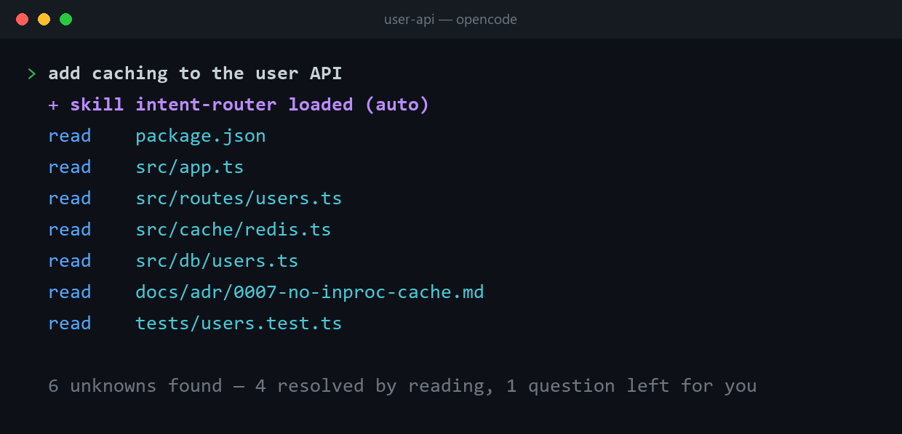
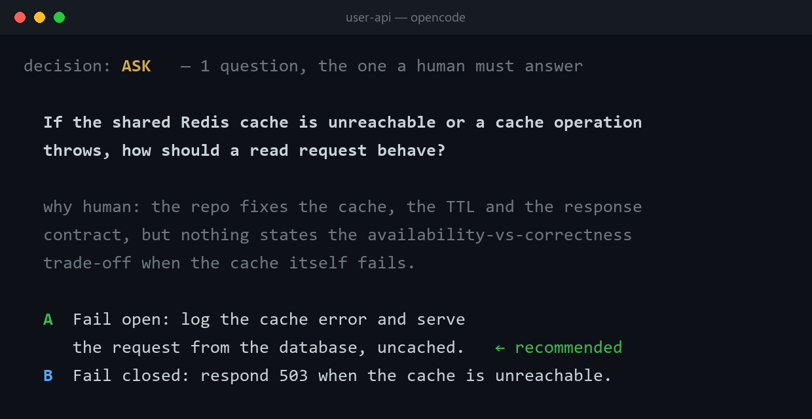
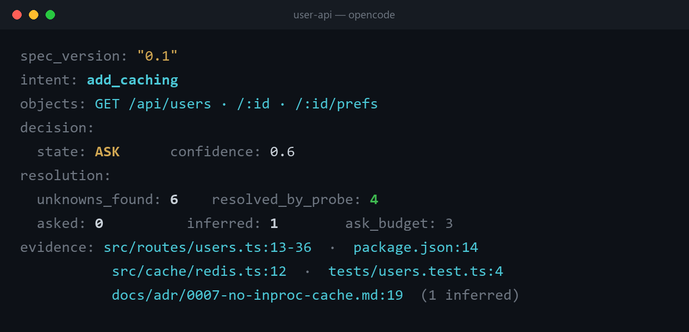

# Intent-Router

[English](README.md) | 简体中文

**给 AI agent 用的意图编译器（intent compiler）。**

把一句含糊的请求变成一份带类型的 `IntentSpec`——带类型的决策模型（Jev、Laya）和下游所有路由器
都默认它已经存在的那份清晰、机器可读的输入：能自己查到的就去查，只问查不到的，意图仍不充分时
拒绝产出。

这给你带来的是：

- **提示词平权。** 不需要先学提示词工程，也能得到高端工程师级别的 agent 交互——"会写提示词的前
  1% 玩家"和其余 99% 的人之间的差距，不再决定你能拿回什么。你只要像对一个靠谱的同事那样说话，
  比如*"给 user API 加缓存"*，那份"资深工程师动手前必写的需求简报"的活儿由它来干。你不再费心
  哄模型，而是让它被你更好地鞭策。
- 只问一个值得你拍板的问题，而且答案落进交付的代码。在任何问题到达你之前，它先去你的仓库、工单系统
  或文档里查一遍，四十六问的盘问于是被压缩成唯一一个真正需要你判断的问题——交付对照中，装了 skill
  的每次运行问的正是这一个问题，3/3 的交付写明了缓存失败策略，不装的 5 次交付一次都没有写
  （[报告](evals/reports/2026-09-24-delivery-opencode.md)）。
- 活儿干得更好，而且能被接续。每次运行都以一份机器可读的 `IntentSpec` 收尾，并先存进
  `.intent/<intent>.intent.yaml`，凡探测过的字段都带 evidence 指针，产出建立在你的项目实际说了
  什么之上，而不是一个没说出口的假设；下一个 agent、下一个 session、下一个同事，从这份契约文件
  接着干，而不是从零开始。

[](LICENSE)
[](https://github.com/angel291592/Intent-Router/releases)
[](https://github.com/angel291592/Intent-Router/actions/workflows/ci.yml)
[](https://github.com/angel291592/Intent-Router/stargazers)
[](#后端分层backends)

```
              "给 user API 加缓存"                   "这个客户炸了，你处理一下"
                        │                                         │
                        ▼                                         ▼
 ┌────────────────────────────────────────────────────────────────────────────────────┐
 │  parse  →  resolve  →  typecheck  →  emit                      一个引擎，一份规格  │
 ├────────────────────────────────────────────────────────────────────────────────────┤
 │  PROBE  依赖、路由、git 历史、ADR          │  订单与工单记录、账户权益、           │
 │         —— 完全不打扰你                    │  当前生效的政策条款                   │
 │                                            │                                       │
 │  ASK    发旧数据，还是不走缓存？           │  退款，还是换货？                     │
 │         唯一没有文件能回答的那个           │  唯一发出去就收不回的那个             │
 └────────────────────────────────────────────────────────────────────────────────────┘
                        │                                         │
                        ▼                                         ▼
                 IntentSpec  ──────►  你的 planner / agent / 工作流 / 人
```

同样三趟、同样的停止谓词。变的只有"它去哪里查"。

<!-- demo:begin -->
一次真实运行的样子：你只说一句话，它自己去读仓库，只问文件回答不了的那一个问题。画面来自
2026-09-23 那次实测运行——也就是下方数字背后的同一轮：当日 10 例套件中 8 例通过，0 条幻觉引用。

<p align="center">
  <br><br>
  <br><br>
  
</p>
<!-- demo:end -->

无需安装，无需 API key，零依赖，它就是一个 skill：

```bash
npx skills add angel291592/Intent-Router
```

手动安装，或安装器不认识的 agent：[快速开始](#快速开始)。

---

## 目录

- [横向对比](#横向对比)
- [问题在哪](#问题在哪) · [它怎么工作](#它怎么工作) · [四个决策态](#四个决策态)
- [两个走通实例](#两个走通实例)——一个在代码仓库里，一个在客服工单里
- [产物](#产物) · [适用领域](#适用领域) · [快速开始](#快速开始) · [评测（Evals）](#评测evals)
- [七条设计原则](#七条设计原则) · [局限](#局限)
- [后端分层（Backends）](#后端分层backends) · [相关工作（Prior art）](#相关工作prior-art) · [参与贡献](#参与贡献)

---

## 横向对比

**Intent-Router 填的正是五个好工具都留空的那一层：在动手之前，先决定该查、该问、还是该做。**
grill-me 收敛得很漂亮、原则也说对了，但什么都不留下。Intent-Router 把那条原则推广成 *grill
anything*：在盘问你之前，先盘问仓库、工单队列、运维手册——一切能替自己作答的东西。
spec-kit 什么都留下，但你得把它整套工作流一起买。路由器决策很快，但根本处理不了模糊。Jev 和
Laya 返回的正是你想要的那种带类型、已校准的决策——*前提是输入已经成型了*：Jev 需要一个组织好的
问题，Laya 需要一份成型的待分类状态。把含糊请求变成那份成型输入，恰恰是难的部分——而它俩都不做
这一步。

要读的是格子里的落差，不是那些勾：

| | 能收敛模糊输入 | 不问自己查得到的 | 机器可读产物 | 可判定的停止 | 自动触发 |
|---|---|---|---|---|---|
| **Intent-Router** | ✅ | ✅ `PROBE`，带 evidence 与 metric | ✅ `IntentSpec` | ✅ 谓词 | ✅ |
| [grill-me](https://github.com/mattpocock/skills) | ✅ 轮次/frontier | ⚠️ 只是原则，未被追踪（无 evidence、无 metric） | ❌ 设计上无状态 | ⚠️ "frontier 空了" | ❌ 手动 |
| [spec-kit `/clarify`](https://github.com/github/spec-kit) | ✅ 11 类扫描 | ❌ 直接问你 | ✅ 回写进 `spec.md` | ✅ ≤10 个问题 | ⚠️ 需要 `specs/<feature>/` 与它的工作流 |
| [semantic-router](https://github.com/aurelio-labs/semantic-router) / [RouteLLM](https://github.com/lm-sys/RouteLLM) | ❌ 返回 `None` | —— | ❌ 一个标签 | ✅ 阈值 | ✅ |
| [Jev](https://www.jevai.org/)（带类型的决策） | ❌ 需要清晰输入 | —— | ✅ 带类型 + 已校准 | ✅ confidence | ✅ |
| [Laya](https://github.com/NandhaKishorM/laya)（开源 System 1） | ❌ 需要成型的状态/问题集 | —— | ✅ 带类型的 `choice`/`score`/`noul` | ✅ 校准概率 | ✅ |

Jev 和 Laya 在同一层——System 1 决策层。Jev 是闭源 API；Laya 是权重开放、与 Jev 线级兼容、可在
本地跑的替代品。两者都是拿到*成型*输入后单次前向回答带类型的问题；两者都不会把含糊请求收敛成
成型输入。上游这个收敛层正是 Intent-Router 所在的位置，而它产出的 `IntentSpec` 正是它们想要的
输入形状。

### 你的 harness 本来就会做什么——以及这层多出了什么

先说句公道话：好的 harness 原生就会"能查到的不问、问的时候给推荐默认值"。这部分不是本 skill
的贡献，本页其余内容也不应被读作在暗示这一点。

它多出的是一段对话装不下的那部分：

- **契约会跨 session 存活。** 原生提问的答案只活在对话里——上下文一压缩、换个 session、换个
  模型，就没了。每份 `IntentSpec` 都先落成 `.intent/` 下的文件级契约，下一个 agent、下一个
  session、下一个同事从它接着干，而不是从零开始。
- **两种失败不合并。** 原生没有 `degraded` 与 `underspecified` 的区分——探测失败与需求欠说明
  会被同一句"我需要更多信息"掩盖。在这里，前者是运维信号，后者是你的下一步；合并它们会让一次
  后端故障被一个看似澄清性的提问掩盖过去。
- **不可逆的猜测拒绝出产。** 原生的偏置是"选一个合理默认值、说明一下、继续做"。当推断值触到
  不可逆边界时，skill 拒绝 ROUTE——宁可 HALT 并报出字段名。

---

## 问题在哪

> 编译器不会去猜一个未定义符号的地址。
> 你的 agent 也不该去猜你的意图。

当你丢给 agent 一句 *"重构一下这个模块"*、*"看看我们的流失率"* 或者 *"这个客户你处理一下"*，
接下来只会发生两件事之一。

**它开始猜。** 你拿到 400 行自信满满的产出，建立在一个你从没做过的假设上。你读完、发现前提就错了、
整份丢掉。它从来没搞错*怎么做*——它搞错的是*你要什么*，而且是在烧完你的 token 之后才发现。

**或者它开始盘问你。** 这比猜要好，也是 `/grill-me` 这类 skill 做得好的地方。但账单是实打实的：
grill-me 自己的文档把 **"四轮四十六个问题"** 称作*一次普通 session*。而盘问结束之后，那个 skill
明确是无状态的——*"它不写任何文件，不留下任何工作区。它唯一留下的，是你自己脑子里那个更清晰的想法。"*

于是你付了两次钱。一次买问题，另一次是因为下游没人读得懂这些答案。下一个 agent、下一个 session、
下一个同事——统统从零开始。

**这两种失败共用一个根因：没有任何人判断过，缺的那条信息到底值不值得去问一个人类。**

那四十六个问题里有一半早就有答案了——在你的 `package.json` 里、你的路由文件里、你的 ADR 里。
或者，换到隔壁那条工单队列：在订单记录里、在账户权益表里、在当前生效的退款政策里。编译器在解析
一个未定义符号时，不会打断你去问 `malloc` 在哪——它自己去给定的库里找。这就是缺掉的那一步，
而这一步跟代码没关系。

---

## 它怎么工作

三趟，按编译器的顺序。

**1. Parse——请求 → 候选结构。** 原始请求变成一份 `IntentSpec` 草稿：归一化的动作、它作用的对象、
用户明确说出的约束，以及一张 `unknown` 字段清单。不发明任何东西；凡是模型自己填进去的都打上
`source: inferred`，让你一眼就能否掉。

**2. Resolve——所有人都跳过的那一步。** 这就是把上下文工程（context engineering）做成一次路由
决策：每个 `unknown` 在到达你之前先被分类：

| 状态 | 什么时候 | 会发生什么 |
|---|---|---|
| **PROBE** | 答案存在于它能够到的地方 | 它自己去读。代码、依赖、配置、版本历史、测试、CI、文档——或者一条工单记录、一张权益表、一份政策文件、你之前的笔记、一个 API。**完全不打扰你。** |
| **ASK** | 答案只存在于人脑里——偏好、权衡、不可逆的边界 | 只问一个问题，给两个具体选项和一个推荐默认值。 |

让这套东西成立的那条规则，也是你应该拿来考核它的那条：

> **只要客观答案存在、而你有办法够到它——就去 PROBE，永远不要 ASK。**
> ASK 只留给那些真的活在人脑里的答案，或者走不回头的决定。

**3. Typecheck & emit——一个可判定的停止条件。** "感觉差不多了就停"的盘问会一路问到四十六个问题，
把上下文窗口撑满。Intent-Router 改成在一个谓词上停：

```
充分  ⟺  每个必填字段都已填上
      ∧  没有任何 inferred 字段触到不可逆边界
```

不充分、而 ASK 预算又用完了？它**不产出**。它停下来，点名还开着的那个字段——就像编译器宁可拒绝
链接，也不会随手挑一个地址。

停下来时带着原因，而且这两种原因永不合并：

- `underspecified`——这个请求确实还不可判定。下一步在你。
- `degraded`——探测失败了、模型超时了、解析崩了。**这是运维信号，不是用户的问题。**

我找到的每一个 clarify/route 库都把这两者塌缩成一个 `FALLBACK`。这就是为什么会出现：某个后端挂了，
路由器悄悄把 100% 流量打给默认处理器打了一整周，而你的日志里一个字都没说。

---

## 四个决策态

| 状态 | 含义 | 产出 |
|---|---|---|
| `ROUTE` | 已充分，目标唯一明确 | `IntentSpec` + 目标 |
| `PROBE` | 缺的信息可以查 | （内部态——回到 resolve 循环） |
| `ASK` | 缺的信息需要人来判断 | 一个问题、两个选项、一个默认值 |
| `HALT` | `underspecified` \| `degraded` | 一个点名的开放字段，或一条运维告警 |

别人把它写成一条**原则**——grill-me 的 `grilling` skill 说 *"找事实是你的活儿，永远不是用户的活儿。"*
Intent-Router 把它做成一个**状态**：每次探测都留下 `evidence` 指针，每次运行都报
`resolved_by_probe / unknowns_found`，而停止是一个谓词，不是一种感觉。

---

## 两个走通实例

同一个引擎、同一份产物，两个完全不同的世界。全量评测数字属于第一个世界；第二个展示当视野里根本
没有代码仓库时，变的是什么——答案是：只有探测面变了，别的都没变。

### A. 在代码仓库里——*"add caching to the user API"*

**Parse** 找出四个未知项：用哪个缓存后端、哪些端点、什么 TTL 策略、失效失败时怎么办。
**Resolve** 在跟你说一个字之前先把它们分类：

```
PROBE  用哪个缓存后端    → package.json: ioredis@5；src/cache/redis.ts 已存在   ✓ 已解决
PROBE  哪些端点          → src/routes/users.ts: 3 个 GET handler                ✓ 已解决
PROBE  TTL 策略          → src/cache/redis.ts:12——仓库惯例是 300s               ✓ 已解决
ASK    失效失败怎么办    → 仓库里没有。这是个权衡。而且不可逆。
```

只有一个问题到你面前：

> **失效失败时，该往哪边失败？**
> **A**（推荐）——不走缓存。更慢，但永远正确。
> **B**——发旧数据。更快，但最多 300s 内可能是错的。
> *为什么这个得问你、不能我定：这是个产品决策——你的用户能不能看到过期数据。它不在你的代码里，
> 而且一旦客户端依赖上了，改回来很贵。*

**Emit**：`unknown: []`，所以它编译通过。`resolved_by_probe: 3, asked: 1`。

而且它还抓到了一件"猜的"和"盘问的"都抓不到的事：ADR 0007 写着进程内缓存早就试过、后来被回退了。
这条约束带着文件指针进了 spec——不是因为你想起来了，而是因为探测很便宜，记性不便宜。

### B. 在客服工单里——*"这个客户炸了，你处理一下"*

一行代码都不涉及。四类未知项照样出现，而且大部分照样是查得到的：

```
PROBE  到底发生了什么    → 订单 #8821：晚到 12 天，承运商标记为丢件          ✓ 已解决
PROBE  他有什么权益      → Pro 套餐，30 天保障——还剩 9 天                   ✓ 已解决
PROBE  我们已经补偿过啥  → 工单 #4402：给过 10% 抵扣，客户拒绝了            ✓ 已解决
ASK    退款还是换货      → 政策两个都允许。发一个就等于否掉另一个。
```

> **退款，还是换货？**
> **A**（推荐）——换货加急。保住订阅；成本由承运商理赔覆盖。
> **B**——全额退款。今天就把纠纷结掉，大概也把这个账户一起结掉。
> *为什么这个得问你、不能我定：两个都被政策允许，由客户的偏好来定，而退款一旦发出就收不回来。*

`resolved_by_probe: 3, asked: 1`——而且 agent 从头到尾没让客户再把事情重讲一遍，因为工单里已经写了。
"这笔购买还在保障期内吗"是一条**记录**，不是一个观点；去问它，正是这东西要消灭的那个 bug。

> **诚实声明：** 实例 A 是[评测套件](#评测evals)覆盖、也是上面截图对应的那个领域。实例 B 所在的
> 领域有自己的实测用例——`support-delegate-irreversible` 已在
> [2026-09-23 子集运行](evals/reports/2026-09-23-opencode-2.md)中通过——全量数字仍属编码领域。
> 见[适用领域](#适用领域)。

---

## 产物

一个文件，三种消费者：人来审、agent 来执行、审计者来重放。

```yaml
intent: add_caching
objects: [GET /api/users, GET /api/users/:id, GET /api/users/:id/prefs]
constraints:
  - source: explicit
    text: don't change response shape
  - source: probed            # 从 package.json + src/cache/redis.ts 查到
    text: use the existing Redis client, not a new dependency
    evidence: src/cache/redis.ts:12
  - source: probed            # 从版本历史 + docs/adr/0007.md 查到
    text: in-process caching was tried and reverted in #412 — don't reintroduce
    evidence: docs/adr/0007-no-inproc-cache.md
  - source: asked
    text: on invalidation failure, prefer correctness (serve uncached) over availability
unknown: []                   # 空 ⟹ 充分
decision:
  state: ROUTE
  target: implement
  confidence: 0.88
resolution:
  unknowns_found: 4
  resolved_by_probe: 3        # ← 要优化的就是这个数
  asked: 1
trace: [...]                  # 可重放
```

出了代码领域，字段一个都不变——变的只有 `evidence` 指针指向什么。文件路径换成一个记录标识或文档
小节（`record:tickets/4402`、`doc:returns-policy#eu`）；"凡探测过的都必须带指针"这条要求不放松，
只是格式变了。

完整字段清单由 [`intentspec.schema.json`](skills/intent-router/schema/intentspec.schema.json)
（JSON Schema draft 2020-12）固定，四个状态各有一个走通样例在
[`schema/examples/`](skills/intent-router/schema/examples/)。

每份 spec 都会先存到 `.intent/<intent>.intent.yaml`，再写进带着它的那条回复——下一个 agent、
下一个 session、下一个同事从这份文件接着干，它还能跟它产出的 diff 摆在一起，"这个 PR 到底想
干什么"就有了答案，不用再考古。只写这一个文件、不替你提交；请求本身已完整、skill 静默通过时
什么都不写；`.intent/` 进不进版本控制由项目自己决定。同时 `resolved_by_probe / unknowns_found`
依旧是你拿来考核这个工具的数字。

---

## 适用领域

三趟和那条充分性谓词是领域无关的。领域之间变的只有一件事：**客观答案能在哪里被找到。**
状态标注沿用本项目标注 harness 兼容性的同一套说法——实测过、写了规格、或者两者都没有。

| 领域 | PROBE 能够到 | 值得问的那个问题 | 状态 |
|---|---|---|---|
| **编码 agent** | 仓库、依赖、版本历史、测试、CI、ADR | 不可逆的技术权衡 | ✅ **已实测**——[评测套件](#评测evals)，14 个用例 |
| **客服与服务工单** | 工单历史、订单与事件日志、账户权益、当前生效的政策 | 退款还是换货——当两者都被允许、且发一个就否掉另一个 | ✅ **已实测**——1 个用例（`support-delegate-irreversible`），[子集运行](evals/reports/2026-09-23-opencode-2.md) |
| **研究与分析** | 先前笔记、历史报告、在用的来源白名单、已缓存的检索结果 | 深度还是广度——当交付物的形态会因此改变 | 📋 **已写规格** |
| **运维与数据作业** | schema、看板、上一次运行的输出、部署与事故历史、留存策略 | 回填能不能改写历史行 | 📋 **已写规格** |
| **多角色助手** | 候选角色 registry、附件元数据、对话历史、用户等级与地区 | 两个真正重叠的专家该给谁 | 📋 **已写规格** |
| 你的领域 | 你给它接入的任何东西 | —— | 把探测面写出来，它就能编译 |

**已实测** = 该领域至少有一个用例在 [`evals/reports/`](evals/reports/) 的公开报告里通过，每行
都写明是几例。**已写规格** = 探测面、值得问与不值得问的例子，都已写进 skill 的 reference 文件并
按需加载。这里没有任何一行是因为"听起来说得通"就被标成可用的。

多角色这一格额外多一条规则，而它配得上这个位置：**一条路由必须声明自己不是什么。**
光写 `"这种情况路由给我"`，重叠的专家会互相吞掉对方的请求；
`"这种情况别给我 → 该给 Z"` 才是真正把边界钉住的东西。把描述写得更精确从来治不好重叠——
点名邻居才行。

---

## 快速开始

无需安装，无需 API key，零依赖。它就是一个 skill。

```bash
npx skills add angel291592/Intent-Router
```

它会探测你装了哪些 agent 并逐个装进去。skill 名字是 `intent-router`。

<details>
<summary>手动安装，或安装器不认识的 agent</summary>

把 `skills/intent-router/` **这个目录**（不是仓库根目录）拷进你的 agent 会读的目录：

- `.claude/skills/`——Claude Code
- `.agents/skills/`——Cursor、Codex、OpenCode、Gemini CLI、Copilot、Pi、Amp、Zed 等

前面加 `~/` 就是全局安装。逐个 harness 的路径（包括那些用自己专属目录名的）在
[`references/harness-compat.md`](skills/intent-router/references/harness-compat.md)。

**完全没有 skill 机制？** `SKILL.md` 就是一个单文件 markdown，不绑定任何工具——把正文粘进你的
system prompt 即可。`references/` 是按需加载的，可以一起粘，也可以不要。
</details>

然后就照常干活。Intent-Router 的设计意图是**在请求本身不充分时自己触发**——而不是等你想起来去调它。
（相比之下 `grill-me` 自己的文档写着 *"agent 不会主动去用它。"*）想强制触发就：

```
/intent-router refactor the auth module     # Claude Code、Cursor、Copilot、Zed、Kiro、Augment
$intent-router refactor the auth module     # Codex
/skill:intent-router refactor the auth module   # Pi、Kimi Code
```

<details>
<summary>它能在哪些 agent 里跑</summary>

`SKILL.md` 不点名任何工具——它只要求 *"你的环境提供的任何读文件、搜索或 shell 能力"*——所以凡是能读
[Agent Skills](https://agentskills.io/) 格式的地方它都能跑。

**verified**（在这里跑过，报告在 `evals/reports/`）——OpenCode

**spec-compatible**（其文档声称支持标准 `SKILL.md`；本项目未实测）——Claude Code、Codex CLI、
Cursor、GitHub Copilot（CLI 与 VS Code）、Gemini CLI、Antigravity、Windsurf、DeepSeek Harness
（dsh）、Pi、Qwen Code、Kimi Code CLI、Trae、Cline、Roo Code、Kilo Code、Goose、OpenHands、Amp、
Zed、Warp、Kiro CLI、Junie、Augment、Factory Droid

**needs-adapter**（没有公开的 skill 机制；把 `SKILL.md` 粘进 system prompt）——Continue

目录、调用语法与逐个 harness 的注意事项：
[`references/harness-compat.md`](skills/intent-router/references/harness-compat.md)。
</details>

`SKILL.md` 为什么写成这样——逐节的中文导读（skill 本体保持英文单源）：
[`docs/zh-CN/skill-guide.md`](docs/zh-CN/skill-guide.md)。

---

## 评测（Evals）

14 个用例，跑在专门作为探测靶子构建的 fixture 工作区上，在真实 harness 里跑，零 mock。用例断言
决策态、各个计数器，以及**每个 evidence 指针指向的文件必须真实存在**——只要有一处编造的引用，
整个套件就算失败，其他全对也不算。

<!-- evals:begin -->
2026-09-23 · opencode · dp/deepseek-flash · 8/10 cases · probe ratio 0.56 · 0 over-asks · 0 hallucinated evidence
2026-09-23 · opencode · dp/deepseek-flash · 8/8 subset cases · probe ratio 1.00 · 0 over-asks · 0 hallucinated evidence
2026-09-24 · opencode · dp/deepseek-flash · delivery add-caching-delivery · bare 5.0/6 (N=5) · with skill 6.0/6 (N=3) · ADR trap avoided bare 5/5 vs skill 3/3
2026-09-24 · opencode · (harness default) · 4/4 subset cases · probe ratio 0.25 · 0 over-asks · 0 hallucinated evidence
<!-- evals:end -->

逐行说明：第 1 行是 2026-09-23 当日套件规模（10 例）下的全量单次运行；第 2 行是当天提示词强化后
对 8 用例子集的单次重测——子集口径，与全量数字分开陈述；第 3 行是交付对照，本项目的**结果指标**——
skill 臂三次运行全部交付 6/6，且每次都写明了缓存失败策略，不装的 5 次一次都没有；第 4 行是 v1.1.0
发版核验，4 用例子集运行。probe ratio 是**诊断指标**，从不参与判定。套件现为 14 例，全量阈值随之为
14 例中至少通过 12 例、且零编造 evidence；这一规模下的全量运行尚无公开报告。所有公开报告都在
[`evals/reports/`](evals/reports/)。

怎么自己跑、每个用例查什么：[`evals/README.md`](evals/README.md)。

---

## 七条设计原则

1. **PROBE 永远优先于 ASK。** 一个你本来自己能查到的问题，就是一个 bug。盯住
   `resolved_by_probe / unknowns_found` 并把它推高。
2. **停止是算出来的，不是感觉出来的。** 一个跑在必填字段上的谓词，加一个硬性 ASK 预算。
   不会有 session 一路问到四十六个问题。
3. **推断必须可见。** 凡是模型自己填的都打 `inferred` 并带上依据。否掉一行，比多回答三个问题便宜。
4. **两种失败，两种信号。** `underspecified` 该用户动；`degraded` 该叫运维。合并它们等于藏事故。
5. **交出一份契约，不是一段对话。** 如果它不是机器可读的，下一个 session 还是从零开始——而且每份
   spec 都会存进 `.intent/`，契约因此跨 session 存活。
6. **路由要声明自己不是什么。** 负向条件才是防止重叠目标互相渗透的东西。
7. **宁可拒绝，不要猜。** 不充分而且预算用完了？停下来，点名那个开放字段。

---

## 局限

先说清楚，因为你一定会撞上。

- **没有来源，就没法探测。** 这个引擎的上限就是它能够到的东西。**非代码领域不是问题所在**——一套
  工单系统、一份政策文件、一个笔记库，都是很富的探测面。真正**无来源**的场景是：纯对话、什么都没接，
  此时 `PROBE` 无处可查，整条流程退化为提问。那仍然比猜好，但头条收益会小很多。
- **问不出来的问题依然问不出来。** *"这个体验该是什么感觉？"*——探测和提问都解决不了，它需要一个
  能让人产生反应的东西。Intent-Router 会把这类标出来，告诉你去做原型，而不是在上面烧轮次。
  这条局限诚实地继承自 grill-me，它自己也点明了。
- **全量数字只在编码领域。** [评测](#评测evals)里的全量数字属于编码套件。客服工单已有自己的实测
  用例（`support-delegate-irreversible`，子集运行），其余标"已写规格"的领域都是设计与文档，
  **不是实测**。✅ 那几行你可以信；📋 那几行请当作起点，在你自己的场景里自行验证。
- **L0 的 confidence 是模型自报的。** 当序数看，别当校准值。想要真校准（ECE、Brier）？那是 L2。
- **自动触发是概率性的。** 每个 harness 都拿你的请求去匹配 skill 的 `description`，没有一个能保证
  命中。要紧的时候就显式调用。
- **别让它自己验证自己。** 一旦你拿 Intent-Router 自己的标注去训分类器，你得到的是一个对自己的错误
  越来越自信的系统。用独立证据来打标。

---

## 后端分层（Backends）

每一层的决策语义完全相同。默认那层不要钱、不要密钥，也就是当前发布的这层：**L0，纯 prompt。**
另外两层要钱的都在计划中，且都是可选的。

<details>
<summary>分层表，以及 L2 为什么被刻意设计成可选</summary>

| 层 | 后端 | 成本 | 什么时候用 |
|---|---|---|---|
| **L0** *(默认，已发布)* | 纯 prompt。零依赖、零密钥。 | $0 | 永远先从这里开始 |
| **L1** *(计划中)* | 任何 OpenAI 兼容端点 + JSON schema | ~$0.0001/次决策 | 生产环境，需要延迟可控 |
| **L2** *(计划中，可选)* | [Jev](https://www.jevai.org/)、[Laya](https://github.com/NandhaKishorM/laya)（开源、本地）或本地分类器 | ~$0.0004/次决策 | 你需要校准过的 confidence 与审计轨迹 |

L2 是 Jev 社区最终达成的那种分工——*LLM 创建并修复语义结构；一个 System One 模型在已知结构之间
反复做决策*——由 Intent-Router 来提供那个结构。它被刻意设计成可选：Jev 是闭权重、需要排队申请，
基准数据也是厂商自报的；[Laya](https://github.com/NandhaKishorM/laya) 是权重开放的替代品（与
Jev 线级兼容、可本地运行、带一个在 typed-decisions 上微调过的 checkpoint——按它自己的基准，
zero-shot 底子接近随机）。L0 必须永远足以让人先试起来。

</details>

---

## 相关工作（Prior art）

这是一次综合，不是无菌室里的发明。有五个项目塑造了它：
[grill-me](https://github.com/mattpocock/skills)（grilling 原语，以及本项目立足的那条原则）、
[spec-kit](https://github.com/github/spec-kit)（`/clarify` 的有界问题预算）、
[Jev](https://www.jevai.org/)（带类型的决策，以及 LLM→IR→decider 分层）、
[Laya](https://github.com/NandhaKishorM/laya)（权重开放、与 Jev 线级兼容的 System 1 模型——证明
决策层可以放在本地）、
[Camunda #63664](https://github.com/camunda/camunda/issues/63664)（对这个问题最清晰的一次陈述）。
它们命名的那些东西，功劳归它们。

<details>
<summary>每一个具体贡献了什么，以及 Intent-Router 补了什么</summary>

- **[mattpocock/skills](https://github.com/mattpocock/skills)**——`grill-me` 与 grilling 原语。
  轮次/frontier 模型、"被动性"这个失败模式、以及"问得出来 / 问不出来"的区分，全部来自这里。
  它的 `grilling` skill 也正是本项目立足的那条原则的出处——*"找事实是你的活儿，永远不是用户的活儿……
  凡是你自己能查到的，就别问用户"*——命名之功归它。Intent-Router 的贡献是把那条原则变成一个**状态**，
  背后带一份产物：*有状态、自助、且会终止*。
- **[github/spec-kit](https://github.com/github/spec-kit)**——`/clarify`：分类法扫描、有界的问题
  预算、一次一问且带推荐选项、答案回写进产物。设计极好，但与它自己的工作流强耦合。
  Intent-Router 把它解绑了。
- **[TypeSafe Jev](https://www.jevai.org/)** 与
  [非官方工具包](https://github.com/HiQS-Labs/Jev-unofficial-toolkit)——用带类型、已校准的决策
  取代散文，以及塑造了 `IntentSpec` 的那个 LLM→IR→decider 分层。
- **[Laya](https://github.com/NandhaKishorM/laya)** 及其生态
  ([laya-mlx](https://github.com/mizorewww/laya-mlx)、
  [jevbench](https://github.com/dhruvmehra/jevbench))——权重开放、与 Jev 线级兼容的 System 1 层：
  同样的带类型 `choice`/`score`/`noul` 回答，可在本地跑。不想在链路里放一个闭源 API 时，它就是
  自然的 L2 目标。
- **[semantic-router](https://github.com/aurelio-labs/semantic-router)**、
  **[RouteLLM](https://github.com/lm-sys/RouteLLM)**、
  **[vLLM Semantic Router](https://github.com/vllm-project/semantic-router)**——Intent-Router
  向其喂数据、而非取代的那一层路由。
- **[reaatech/confidence-router](https://github.com/reaatech/confidence-router)**、
  **[JevLang](https://github.com/TimMikeladze/JevLang)**——把 route/clarify/fallback 阈值与
  可重放的策略审计做成库。
- **[Camunda #63664](https://github.com/camunda/camunda/issues/63664)**——对这个问题最清晰的一次
  陈述：盘问假设了用户拥有解决方案设计，而用户其实应该拥有**问题**，让 agent 去研究那些可研究的东西。
  `PROBE` 就是这个 issue 变成的状态。

</details>

---

## 参与贡献

欢迎 issue 与 PR——见 [CONTRIBUTING.md](CONTRIBUTING.md)。

## 许可

MIT
